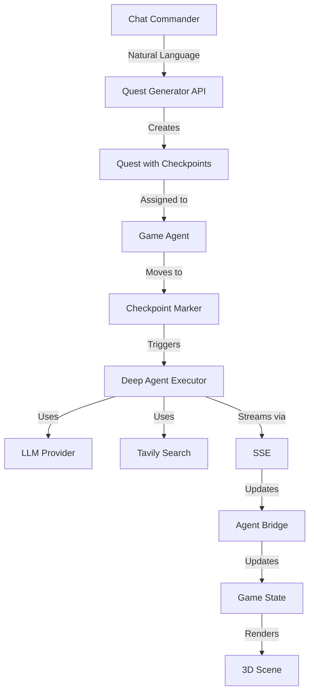

# Agents of Empire 🏰

A revolutionary **3D RTS game** powered by **real AI agents** that execute tasks, complete quests, and evolve through gameplay. Built with Next.js, Three.js, and LangChain Deep Agents.


## 🎮 What is Agents of Empire?

Agents of Empire is a **real-time strategy game** where AI agents are the units. Watch them think, plan, and execute tasks in a beautiful 3D environment. Generate quests using natural language, assign agents, and observe as they use real AI tools to complete objectives.

### 🌟 Key Features

#### 🤖 **Real AI Agents**
- **LangChain Deep Agents** with actual tool execution
- **Live agent state** (IDLE, THINKING, WORKING, COMPLETED)
- **Token usage tracking** and performance metrics
- **Multi-provider support** (Anthropic, OpenAI, ZAI, Groq, etc.)

#### 🎯 **Quest System**
- **Natural language quest generation** via Chat Commander
- **Checkpoint-based execution** with visual markers
- **AI-powered task breakdown** into executable steps
- **Progress tracking** with real-time updates

#### 🛠️ **Agent Tools**
- **Tavily Web Search** - Real-time web research
- **File Operations** - Read, write, edit code
- **Command Execution** - Run shell commands
- **Custom Tools** - Extensible tool system

#### 📊 **Intelligence Bureau**
- **LangSmith trace visualization** (optional)
- **Real-time thinking display**
- **Tool execution tracking**
- **Debug and monitoring**

#### 📝 **Live Logs**
- **Real-time event streaming** (SSE)
- **Color-coded log levels** (info, warn, error, success)
- **Source tagging** (client, agent, system)
- **Keyboard shortcut**: `Shift+L`

#### 🎨 **3D Game World**
- **Beautiful terrain** with enhanced landscapes
- **Water features** and natural elements
- **Dynamic lighting** and post-processing effects
- **Camera controls** (rotate, zoom, pan)

#### 🐉 **Dragons & Companions**
- **Dragon allies** that support agents
- **Formation system** for coordinated movement
- **Visual effects** and animations
- **Party management**

## 🚀 Quick Start

### Prerequisites

**IMPORTANT: This project uses pnpm. Do NOT use npm or yarn.**

```bash
# Install pnpm globally
npm install -g pnpm
# or
curl -fsSL https://get.pnpm.io/install.sh | sh -

# Verify installation
pnpm --version
```

### Installation

1. **Clone the repository:**
   ```bash
   git clone https://github.com/DavinciDreams/agents-of-empires.git
   cd agents-of-empire
   ```

2. **Install dependencies:**
   ```bash
   pnpm install
   ```

3. **Set up environment variables:**
   ```bash
   cp .env.example .env
   ```

   Edit `.env` and add your API keys:
   ```bash
   # Required - Choose at least one LLM provider
   ANTHROPIC_API_KEY=sk-ant-...          # Recommended
   OPENAI_API_KEY=sk-...
   ZAI_API_KEY=...                       # Alternative provider

   # Optional - Enhanced features
   TAVILY_API_KEY=tvly-...               # Web search capability
   LANGSMITH_API_KEY=...                 # Trace monitoring
   LANGSMITH_WORKSPACE_ID=...

   # Optional - Other providers
   GROQ_API_KEY=...
   TOGETHER_API_KEY=...
   PERPLEXITY_API_KEY=...
   ```

4. **Run the development server:**
   ```bash
   pnpm dev
   ```

5. **Open the game:**
   Navigate to [http://localhost:3000](http://localhost:3000)

## 🎯 How to Play

### 1. Generate a Quest

Click the **Chat input** at the bottom and describe what you want:
```
"Create a quest to analyze the codebase and suggest improvements"
"Build a feature to add dark mode to the website"
"Research the latest AI trends and write a summary"
```

The AI will generate a multi-step quest with checkpoints.

### 2. Assign an Agent

- Click on an **agent** (glowing orb) in the 3D world
- Click **"Assign to Quest"**
- Select your quest from the list

### 3. Watch the Magic

- Agent **moves** to the first checkpoint
- **Deep Agent executes** the task using real AI
- View **live logs** with `Shift+L`
- Check **Intelligence Bureau** for detailed traces
- Monitor **progress** in the Agent Progress HUD

### 4. Track Progress

- **Agent Progress HUD**: Shows current step and token usage
- **Checkpoint Markers**: Change color (blue → gold → green)
- **Live Logs**: Real-time event streaming
- **Intelligence Bureau**: Detailed execution traces

## 🎮 Controls

| Action | Control |
|--------|---------|
| **Rotate Camera** | Left Mouse + Drag |
| **Pan Camera** | Right Mouse + Drag |
| **Zoom** | Mouse Wheel |
| **Select Agent** | Left Click on Agent |
| **Multi-Select** | Hold Shift + Click |
| **Deselect** | Click on Terrain |
| **Toggle Logs** | Shift + L |
| **Open Chat** | Click Chat Input |
| **Cycle Agents** | Tab / Shift+Tab |

## 📁 Project Structure

```
agents-of-empire/
├── app/
│   ├── api/
│   │   ├── agents/
│   │   │   ├── execute/          # Deep Agent execution endpoint
│   │   │   ├── [agentId]/
│   │   │   │   ├── traces/       # LangSmith trace fetching
│   │   │   │   ├── invoke/       # A2A protocol
│   │   │   │   └── stream/       # A2UI streaming
│   │   └── quests/
│   │       └── generate/         # AI quest generation
│   │
│   ├── components/
│   │   └── a2ui/
│   │       └── game/
│   │           ├── core/         # Game engine & logic
│   │           ├── entities/     # Agents, dragons, structures
│   │           ├── ui/           # HUD, panels, controls
│   │           ├── world/        # Terrain, water, features
│   │           ├── effects/      # Animations, particles
│   │           ├── store/        # Zustand state management
│   │           └── bridge/       # Agent Bridge (SSE streaming)
│   │
│   └── lib/
│       └── deepagents-interop/   # Deep Agents integration
│           ├── a2a/              # Agent-to-Agent protocol
│           ├── tools/            # Custom game tools
│           └── sandbox/          # Local sandbox
│
├── docs/                         # Documentation
├── screenshots/                  # Game screenshots
└── sandbox-workspace/           # Agent workspace
```

## 🔧 API Endpoints

### Deep Agents Execution

#### `POST /api/agents/execute`
Execute a checkpoint task with a Deep Agent (SSE streaming).

**Request:**
```json
{
  "agentId": "agent-1",
  "checkpointId": "cp-1",
  "task": "Analyze the React components and suggest optimizations",
  "estimatedTokens": 5000
}
```

**Response:** Server-Sent Events
```
event: start
data: {"agentId":"agent-1","checkpointId":"cp-1","task":"..."}

event: thinking
data: {"message":"Analyzing task..."}

event: token
data: {"token":"I'll analyze"}

event: tool_start
data: {"tool":"tavily_search","input":"React optimization techniques"}

event: tool_end
data: {"output":"Found 5 results..."}

event: complete
data: {"output":"...","tokens":4523,"todos":[...]}
```

### Quest Generation

#### `POST /api/quests/generate`
Generate a multi-step quest from natural language.

**Request:**
```json
{
  "command": "create a quest to add authentication to the app"
}
```

**Response:**
```json
{
  "quest": {
    "title": "Implement Authentication System",
    "description": "...",
    "complexity": "hard",
    "estimatedDuration": 7200000
  },
  "checkpoints": [
    {
      "title": "Design Auth Schema",
      "description": "...",
      "estimatedTokens": 3000
    }
  ]
}
```

### LangSmith Traces

#### `GET /api/agents/[agentId]/traces`
Fetch execution traces from LangSmith (optional).

**Query Parameters:**
- `limit` - Number of traces (default: 50)
- `since` - ISO timestamp for filtering

**Response:**
```json
{
  "traces": [
    {
      "id": "run-123",
      "timestamp": 1234567890,
      "type": "tool",
      "content": "Searching web...",
      "duration": 1523
    }
  ],
  "count": 10,
  "agent_id": "agent-1"
}
```

## 🛠️ Environment Variables

### Required (Choose at least one)

| Variable | Description | Example |
|----------|-------------|---------|
| `ANTHROPIC_API_KEY` | Claude API key (recommended) | `sk-ant-...` |
| `OPENAI_API_KEY` | OpenAI API key | `sk-...` |
| `ZAI_API_KEY` | ZAI API key | `...` |

### Optional Features

| Variable | Description | Default |
|----------|-------------|---------|
| `TAVILY_API_KEY` | Web search capability | - |
| `LANGSMITH_API_KEY` | Trace monitoring | - |
| `LANGSMITH_WORKSPACE_ID` | LangSmith workspace | - |
| `LANGSMITH_ENDPOINT` | LangSmith endpoint | `https://api.smith.langchain.com` |
| `NEXT_PUBLIC_BASE_URL` | Base URL for app | `http://localhost:3000` |

### Other Providers

| Variable | Provider |
|----------|----------|
| `GROQ_API_KEY` | Groq (ultra-fast inference) |
| `TOGETHER_API_KEY` | Together AI |
| `PERPLEXITY_API_KEY` | Perplexity |
| `OPENROUTER_API_KEY` | OpenRouter (200+ models) |

## 🧪 Development

### Run Tests
```bash
pnpm test
```

### Build for Production
```bash
pnpm build
```

### Start Production Server
```bash
pnpm start
```

### Lint Code
```bash
pnpm lint
```

## 📚 Documentation

- 📖 [PRD (Product Requirements)](docs/PRD.md) - Complete feature specification
- 🎮 [Quest System Implementation](QUEST_SYSTEM_IMPLEMENTATION.md) - Quest mechanics
- 🎨 [GUI Overhaul Summary](GUI_OVERHAUL_SUMMARY.md) - UI/UX design
- 🤝 [Contributing Guide](docs/CONTRIBUTING.md) - How to contribute

### Integration Docs
- 🎯 [Phase 1: Agent Cards](docs/PHASE1_COMPLETE.md)
- 🔄 [Phase 2: A2A Protocol](docs/PHASE2_ENHANCED.md)
- ✨ [Phase 3: A2UI Streaming](docs/PHASE3_COMPLETE.md)
- ✅ [Integration Complete](docs/INTEGRATION_COMPLETE.md)

## 🏗️ Architecture

### Tech Stack

- **Frontend**: Next.js 16, React 19, TypeScript
- **3D Engine**: Three.js, React Three Fiber, Drei
- **AI Framework**: LangChain, Deep Agents
- **State Management**: Zustand with Immer
- **Styling**: Tailwind CSS 4
- **Animations**: Framer Motion
- **Build**: Turbopack

### Agent System



## 🎯 Features Overview

### ✅ Implemented

- [x] Real-time 3D RTS game
- [x] Deep Agents with live execution
- [x] Natural language quest generation
- [x] Checkpoint-based task system
- [x] Live logs viewer (Shift+L)
- [x] Intelligence Bureau (LangSmith traces)
- [x] Agent progress tracking
- [x] Tavily web search integration
- [x] Multi-agent selection
- [x] Dragon companions
- [x] Party formations
- [x] Structure buildings
- [x] Victory effects
- [x] Combat animations
- [x] Dark mode support
- [x] Vercel deployment ready

### 🚧 Roadmap

- [ ] Agent interaction UI (VRM avatars)
- [ ] Voice chat with agents
- [ ] Generative canvas for agent work
- [ ] Multiplayer support
- [ ] Agent marketplace
- [ ] Custom tool builder
- [ ] Save/load game state
- [ ] Achievement system

## 🤝 Contributing

We welcome contributions! Please see our [Contributing Guide](docs/CONTRIBUTING.md) for details.

### Quick Contribution Steps

1. Fork the repository
2. Create a feature branch: `git checkout -b feature/amazing-feature`
3. Make your changes
4. Run tests: `pnpm test`
5. Commit: `git commit -m 'feat: add amazing feature'`
6. Push: `git push origin feature/amazing-feature`
7. Open a Pull Request

## 📝 License

This project is licensed under the MIT License - see the [LICENSE](LICENSE) file for details.

## 🙏 Acknowledgments

- **LangChain** for the Deep Agents framework
- **Anthropic** for Claude AI
- **Vercel** for Next.js and hosting
- **Three.js** community for the 3D engine
- **All contributors** who helped build this

## 🔗 Links

- 🌐 [Live Demo](https://agents-of-empire.vercel.app) (Coming Soon)
- 📖 [Documentation](docs/)
- 🐛 [Report Bug](https://github.com/DavinciDreams/agents-of-empires/issues)
- 💡 [Request Feature](https://github.com/DavinciDreams/agents-of-empires/issues)
- 💬 [Discord Community](https://discord.gg/...) (Coming Soon)

## ⚡ Performance

- **Build Time**: ~6s
- **First Load**: <3s
- **Agent Response**: 2-10s (depending on task complexity)
- **60 FPS** gameplay on modern hardware

---

**Built with ❤️ by the Agents of Empire team**

**Co-Authored-By: Claude Sonnet 4.5** 🤖
