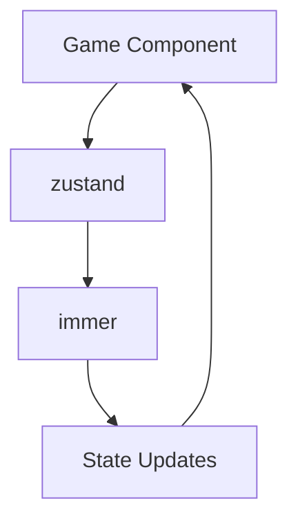

# Package & Submodule Architecture

Complete reference guide for packages, submodules, and their usage throughout the project.

## 📦 Package Overview

### Workspace Structure

```yaml
# pnpm-workspace.yaml
packages:
  - "."                      # Main application (agents-of-empire)
  - "deepagentsjs/libs/*"   # DeepAgents libraries (submodule)
  - "deepagentsjs/examples" # DeepAgents examples (submodule)
```

### Submodule: deepagentsjs

**Location:** `./deepagentsjs/`
**Commit:** `ae70fa400eb3b9710f7917467574d6e08b6583aa`
**Tag:** `deepagents@1.7.5-1-gae70fa4`
**Repository:** https://github.com/langchain-ai/deepagentsjs

#### Submodule Packages

The deepagentsjs submodule contains multiple packages:

```
deepagentsjs/
├── libs/
│   ├── deepagents/          # Core Deep Agents library
│   ├── cli/                 # CLI tools
│   └── providers/
│       ├── daytona/         # Daytona sandbox provider
│       ├── deno/            # Deno sandbox provider
│       ├── modal/           # Modal sandbox provider
│       └── node-vfs/        # Node VFS sandbox provider
└── examples/                # Example implementations
```

**Note:** We don't directly use the submodule packages in production. Instead, we use the published npm package.

---

## 📚 Package Dependencies

### Production Dependencies (package.json)

#### Deep Agents Ecosystem

| Package | Version | Source | Usage |
|---------|---------|--------|-------|
| `deepagents` | `^1.7.5` | **npm** (published) | Core Deep Agents functionality |
| `langchain` | `^1.2.20` | npm | LangChain framework |
| `langsmith` | `^0.5.2` | npm | LangSmith tracing (optional) |

**Important:** We use the **published npm package** (`deepagents@^1.7.5`), NOT the workspace reference (`workspace:*`).

**Why?**
- ✅ Vercel deployment compatible
- ✅ No submodule access needed
- ✅ Stable versioned releases
- ✅ Works on any platform

#### LangChain Packages

| Package | Version | Purpose |
|---------|---------|---------|
| `@langchain/core` | `^1.1.21` | Core LangChain types and interfaces |
| `@langchain/langgraph` | `^1.1.4` | State graph and agent framework |
| `@langchain/langgraph-checkpoint` | `^1.0.0` | Checkpointing for stateful agents |
| `@langchain/anthropic` | `^1.3.12` | Claude AI integration |
| `@langchain/openai` | `^1.2.7` | OpenAI/GPT integration |
| `@langchain/tavily` | `^1.2.0` | Tavily web search tool |

#### 3D Game Engine

| Package | Version | Purpose |
|---------|---------|---------|
| `three` | `^0.173.0` | 3D graphics engine |
| `@react-three/fiber` | `^9.1.2` | React renderer for Three.js |
| `@react-three/drei` | `^9.121.4` | Useful helpers for R3F |
| `@react-three/postprocessing` | `^3.0.4` | Post-processing effects |

#### React & Next.js

| Package | Version | Purpose |
|---------|---------|---------|
| `next` | `16.1.6` | Next.js framework |
| `react` | `19.2.3` | React library |
| `react-dom` | `19.2.3` | React DOM renderer |

#### State & UI

| Package | Version | Purpose |
|---------|---------|---------|
| `zustand` | `^5.0.3` | State management |
| `immer` | `^10.0.0` | Immutable state updates |
| `framer-motion` | `^12.0.6` | Animations |
| `react-markdown` | `^10.1.0` | Markdown rendering |
| `react-syntax-highlighter` | `^16.1.0` | Code syntax highlighting |

#### Utilities

| Package | Version | Purpose |
|---------|---------|---------|
| `zod` | `^4.3.6` | Schema validation |
| `uuid` | `^11.0.0` | UUID generation |
| `openai` | `^6.17.0` | OpenAI SDK (for types) |

---

## 🔍 Import Patterns

### Deep Agents Imports

#### Direct Imports (Published Package)

```typescript
// ✅ CURRENT: Published npm package
import { createDeepAgent } from "deepagents";
import type { DeepAgent, CreateDeepAgentParams, SubAgent } from "deepagents";
import { StoreBackend } from "deepagents";
```

#### Workspace Imports (DEPRECATED)

```typescript
// ❌ OLD: Workspace reference (removed for Vercel compatibility)
// "deepagents": "workspace:*"  // This no longer works
```

**Files Using `deepagents`:**

1. `app/api/agents/execute/route.ts`
   ```typescript
   import { createDeepAgent } from "deepagents";
   ```

2. `app/lib/deepagents-interop/a2a/registry.ts`
   ```typescript
   import { createDeepAgent } from "deepagents";
   import type { SubAgent } from "deepagents";
   ```

3. `app/lib/deepagents-interop/sandbox/LocalSandbox.ts`
   ```typescript
   import { ... } from "deepagents";
   ```

4. `app/lib/deepagents-interop/backends/store-backend.ts`
   ```typescript
   import { StoreBackend } from "deepagents";
   ```

5. `app/components/a2ui/game/bridge/agentConfig.ts`
   ```typescript
   import { createDeepAgent } from "deepagents";
   import type { DeepAgent, CreateDeepAgentParams, SubAgent } from "deepagents";
   ```

### LangChain Imports

#### Core Framework

```typescript
// Messages
import { HumanMessage, AIMessage, SystemMessage } from "@langchain/core/messages";
import type { BaseMessage } from "@langchain/core/messages";

// Tools
import type { StructuredTool } from "@langchain/core/tools";

// Models
import type { BaseLanguageModel } from "@langchain/core/language_models/base";
import type { BaseChatModel } from "@langchain/core/language_models/chat_models";

// Middleware
import type { AgentMiddleware } from "langchain";
```

#### Provider Integrations

```typescript
// Anthropic (Claude)
import { ChatAnthropic } from "@langchain/anthropic";

// OpenAI (GPT)
import { ChatOpenAI } from "@langchain/openai";

// Tavily (Web Search)
import { TavilySearch } from "@langchain/tavily";
```

#### State Management

```typescript
// LangGraph
import type { CompiledStateGraph } from "@langchain/langgraph";

// Checkpointing
import { MemorySaver, InMemoryStore } from "@langchain/langgraph-checkpoint";
```

**Files Using LangChain:**

1. `app/api/agents/execute/route.ts`
   - `@langchain/core/messages` - HumanMessage
   - `@langchain/tavily` - TavilySearch

2. `app/lib/deepagents-interop/a2a/providers.ts`
   - `@langchain/openai` - ChatOpenAI
   - `@langchain/anthropic` - ChatAnthropic

3. `app/lib/deepagents-interop/tools/gameTools.ts`
   - `@langchain/core/tools` - StructuredTool

4. `app/lib/deepagents-interop/backends/store-backend.ts`
   - `@langchain/langgraph-checkpoint` - MemorySaver, InMemoryStore

### Three.js Imports

```typescript
// Core Three.js
import * as THREE from "three";

// React Three Fiber
import { Canvas, useFrame, useThree } from "@react-three/fiber";

// Drei Helpers
import {
  OrbitControls,
  Environment,
  PerspectiveCamera,
  useGLTF,
  Html
} from "@react-three/drei";

// Post-processing
import { EffectComposer, Bloom } from "@react-three/postprocessing";
```

---

## 🏗️ Architecture Layers

### Layer 1: Core Frameworks

```
┌─────────────────────────────────────────┐
│  Next.js 16.1.6 + React 19.2.3         │
│  - App Router                           │
│  - API Routes                           │
│  - Server Components                    │
│  - Turbopack                            │
└─────────────────────────────────────────┘
```

### Layer 2: AI & Agent Framework

```
┌─────────────────────────────────────────┐
│  Deep Agents (published npm)            │
│  deepagents@^1.7.5                      │
├─────────────────────────────────────────┤
│  LangChain Ecosystem                    │
│  - langchain@^1.2.20                   │
│  - @langchain/core@^1.1.21             │
│  - @langchain/langgraph@^1.1.4         │
│  - @langchain/anthropic@^1.3.12        │
│  - @langchain/openai@^1.2.7            │
│  - @langchain/tavily@^1.2.0            │
└─────────────────────────────────────────┘
```

### Layer 3: Game Engine

```
┌─────────────────────────────────────────┐
│  Three.js Ecosystem                     │
│  - three@^0.173.0                      │
│  - @react-three/fiber@^9.1.2           │
│  - @react-three/drei@^9.121.4          │
│  - @react-three/postprocessing@^3.0.4  │
└─────────────────────────────────────────┘
```

### Layer 4: State & UI

```
┌─────────────────────────────────────────┐
│  State Management                       │
│  - zustand@^5.0.3                      │
│  - immer@^10.0.0                       │
├─────────────────────────────────────────┤
│  UI Components                          │
│  - framer-motion@^12.0.6               │
│  - react-markdown@^10.1.0              │
│  - react-syntax-highlighter@^16.1.0    │
└─────────────────────────────────────────┘
```

---

## 🔄 Dependency Flow

### Agent Execution Flow

```mermaid
graph TD
    A[Next.js API Route] --> B[deepagents]
    B --> C[@langchain/core]
    B --> D[@langchain/langgraph]
    C --> E[Provider: @langchain/anthropic]
    C --> F[Provider: @langchain/openai]
    D --> G[Tool: @langchain/tavily]
    G --> H[External: Tavily API]
    E --> I[External: Anthropic API]
    F --> J[External: OpenAI API]
```

### 3D Rendering Flow

```mermaid
graph TD
    A[React Component] --> B[@react-three/fiber]
    B --> C[three.js]
    B --> D[@react-three/drei]
    B --> E[@react-three/postprocessing]
    D --> C
    E --> C
```

### State Management Flow



---

## 📍 Package Locations by Feature

### Deep Agents Integration

**Files:**
- `app/api/agents/execute/route.ts` - Main execution endpoint
- `app/lib/deepagents-interop/a2a/registry.ts` - Agent registry
- `app/lib/deepagents-interop/backends/store-backend.ts` - Backend
- `app/components/a2ui/game/bridge/agentConfig.ts` - Config

**Dependencies:**
```json
{
  "deepagents": "^1.7.5",
  "langchain": "^1.2.20",
  "@langchain/core": "^1.1.21",
  "@langchain/langgraph": "^1.1.4"
}
```

### Quest Generation

**Files:**
- `app/api/quests/generate/route.ts` - Quest generation API

**Dependencies:**
```json
{
  "deepagents": "^1.7.5",
  "@langchain/core": "^1.1.21"
}
```

### LangSmith Traces

**Files:**
- `app/api/agents/[agentId]/traces/route.ts` - Traces API

**Dependencies:**
```json
{
  "langsmith": "^0.5.2"
}
```

### Tavily Search

**Files:**
- `app/api/agents/execute/route.ts` - Uses TavilySearch

**Dependencies:**
```json
{
  "@langchain/tavily": "^1.2.0"
}
```

### 3D Game World

**Files:**
- `app/components/a2ui/game/**/*.tsx` - All game components

**Dependencies:**
```json
{
  "three": "^0.173.0",
  "@react-three/fiber": "^9.1.2",
  "@react-three/drei": "^9.121.4",
  "@react-three/postprocessing": "^3.0.4"
}
```

### State Management

**Files:**
- `app/components/a2ui/game/store/gameStore.ts` - Main store

**Dependencies:**
```json
{
  "zustand": "^5.0.3",
  "immer": "^10.0.0"
}
```

---

## 🔧 Version Alignment

### Critical Version Compatibility

The following packages MUST be version-aligned:

```typescript
// These versions are aligned with deepagents@^1.7.5
{
  "@langchain/core": "^1.1.21",      // Required by deepagents
  "@langchain/langgraph": "^1.1.4",  // Required by deepagents
  "langchain": "^1.2.20"             // Required by deepagents
}
```

**Why?** DeepAgents v1.7.5 expects specific LangChain versions. Mismatches cause TypeScript errors.

### Provider Compatibility

```typescript
// These can be independently upgraded
{
  "@langchain/anthropic": "^1.3.12",  // Claude provider
  "@langchain/openai": "^1.2.7",      // OpenAI provider
  "@langchain/tavily": "^1.2.0"       // Tavily search
}
```

---

## 🚨 Common Issues

### Issue 1: Workspace vs Published Package

**Problem:**
```json
{
  "deepagents": "workspace:*"  // ❌ Fails on Vercel
}
```

**Solution:**
```json
{
  "deepagents": "^1.7.5"  // ✅ Works on Vercel
}
```

### Issue 2: Version Conflicts

**Problem:**
```
Type 'AsyncCaller' is not assignable to type 'AsyncCaller'
```

**Cause:** Different versions of `@langchain/core` between deepagents and our app.

**Solution:** Align versions with deepagents requirements:
```json
{
  "@langchain/core": "^1.1.21"  // Must match deepagents
}
```

### Issue 3: Module Not Found

**Problem:**
```
Error: Cannot find module 'deepagents'
```

**Cause:** Missing Next.js configuration for ESM module.

**Solution:** Add to `next.config.ts`:
```typescript
{
  serverExternalPackages: ['deepagents']
}
```

---

## 📊 Package Statistics

### Total Dependencies

- **Production:** 24 packages
- **Development:** 10 packages
- **Total:** 34 packages

### By Category

| Category | Count | Examples |
|----------|-------|----------|
| AI/Agents | 7 | deepagents, langchain, @langchain/* |
| 3D Graphics | 4 | three, @react-three/* |
| Framework | 3 | next, react, react-dom |
| State/UI | 6 | zustand, immer, framer-motion |
| Utilities | 4 | zod, uuid, openai |

### Package Size (Estimated)

- **deepagents**: ~1.2 MB
- **langchain + @langchain/***: ~8 MB
- **three.js + R3F**: ~5 MB
- **next + react**: ~3 MB
- **Total**: ~20 MB (unpacked)

---

## 🔍 Verification Commands

### Check Package Versions

```bash
# View all dependencies
pnpm list --depth 0

# Check specific package
pnpm list deepagents
pnpm list @langchain/core

# Check for outdated packages
pnpm outdated
```

### Check Submodule Status

```bash
# View submodule commit
git submodule status

# View submodule remote
cd deepagentsjs && git remote -v

# Update submodule
git submodule update --remote deepagentsjs
```

### Verify Imports

```bash
# Find all deepagents imports
grep -r "from ['\"]deepagents" app/

# Find all langchain imports
grep -r "from ['\"]@langchain" app/

# Find all three.js imports
grep -r "from ['\"]three" app/
grep -r "from ['\"]@react-three" app/
```

---

## 📚 Related Documentation

- [README.md](../README.md) - Project overview
- [CHANGELOG.md](../CHANGELOG.md) - Version history
- [API.md](API.md) - API reference
- [PRD.md](PRD.md) - Product requirements

---

**Last Updated:** 2025-02-12
**Maintained by:** Agents of Empire Team
**Co-Authored-By:** Claude Sonnet 4.5 🤖
